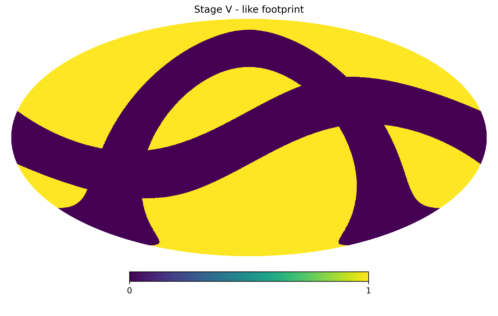
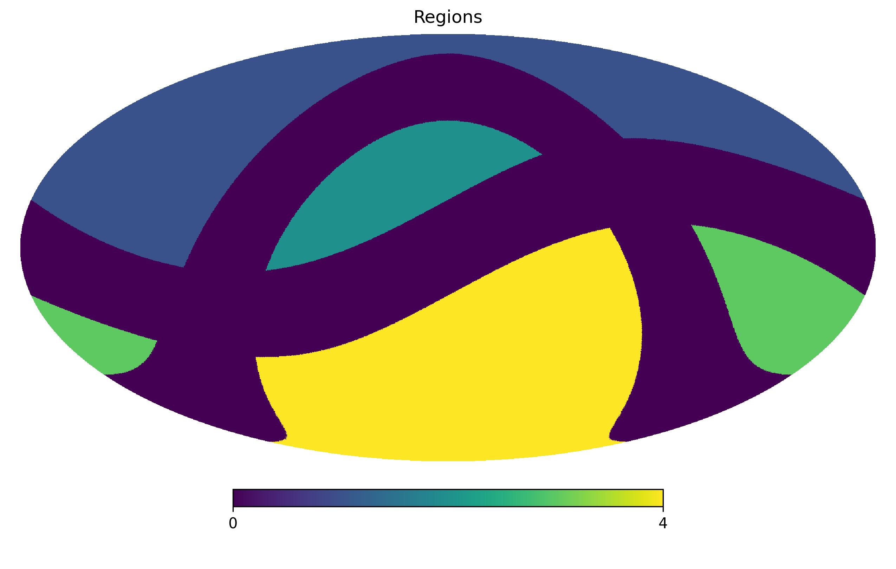
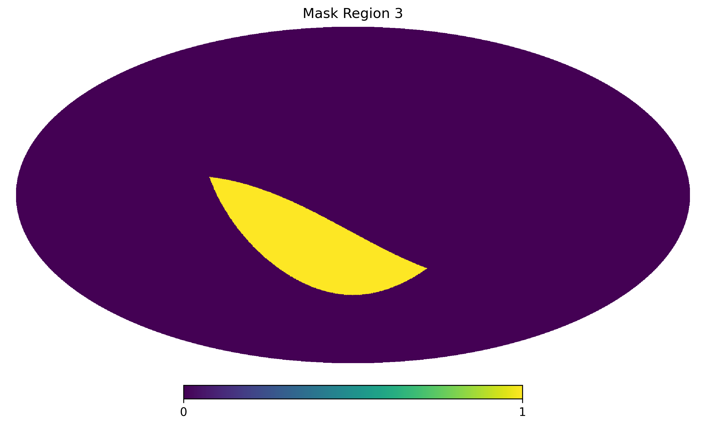
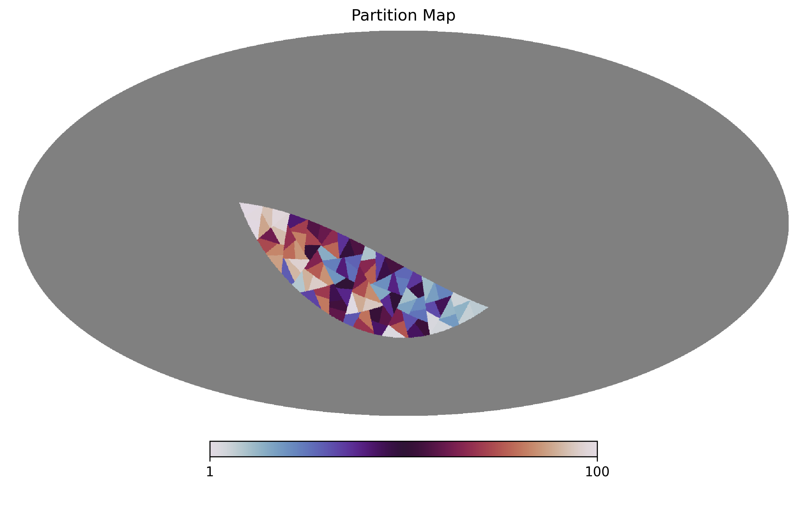
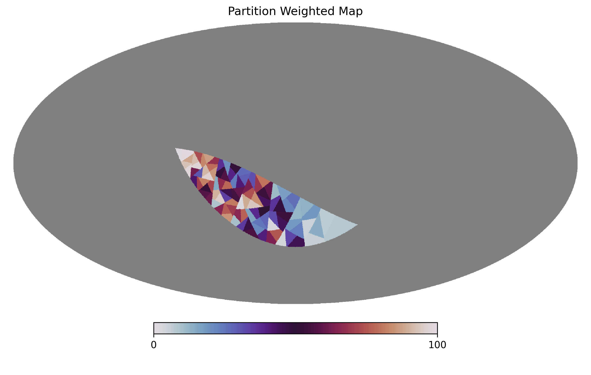
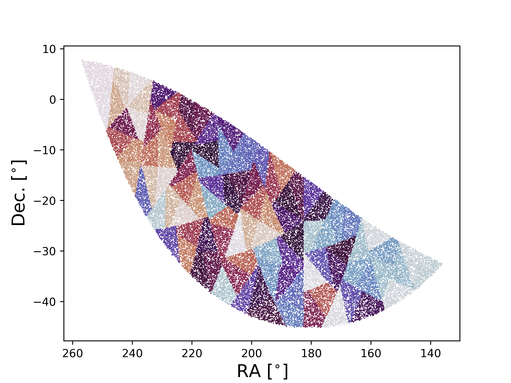
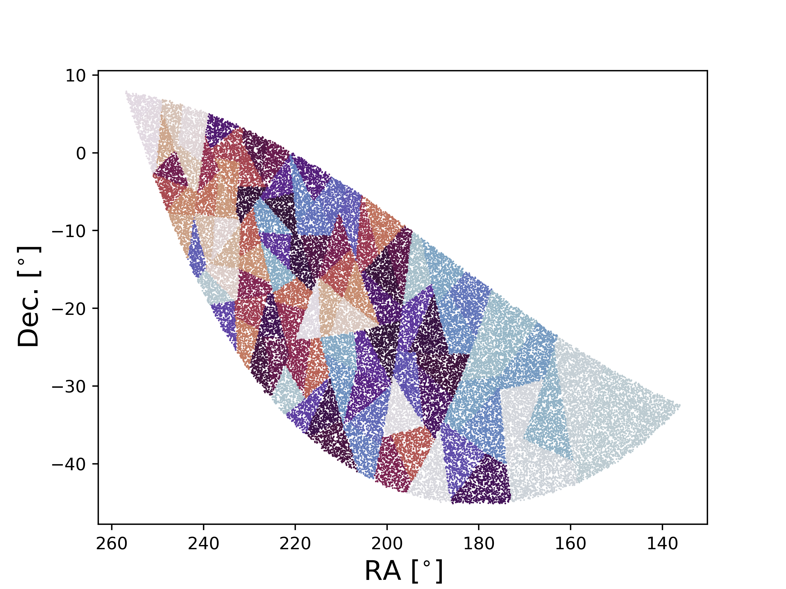

Advanced Usage
==============

Region finding
--------------

There will be cases when the region on the sky that we want to partition is complex and is non-contiguous. 
These regions may be trivial, but they also may be complex -- for the latter it is useful to have software
that can automatically identify these regions. To demonstrate how this works, let's start by first defining
a stage V survey like footprint.

.. code-block:: python

    import numpy as np
    import matplotlib.pylab as plt
    import healpy as hp
    import skysegmentor

    nside = 256

    # ----------------------------------------------------------------------------
    # the exact details used to define this are not important but placed 
    # here so you can reproduce this example.

    pixID = np.arange(hp.nside2npix(nside))
    map0 = np.ones(hp.nside2npix(nside))

    rot = hp.Rotator(coord=['E', 'G'])

    map0 = rot.rotate_map_pixel(map0)

    the, phi = hp.pix2ang(nside, pixID)

    cond = np.where((the >= np.deg2rad(90.-15.)) & (the <= np.deg2rad(90.+15.)))[0]
    map0[cond] = 0.

    rot = hp.Rotator(coord=['G', 'C'])

    map0 = rot.rotate_map_pixel(map0)

    cond = np.where((the >= np.deg2rad(90.-15.)) & (the <= np.deg2rad(90.+15.)))[0]
    map0[cond] = 0.

    rot = hp.Rotator(coord=['C', 'E'])

    map0 = rot.rotate_map_pixel(map0)

    cond = np.where(map0 > 0.5)[0]
    map0[cond] = 1.
    cond = np.where(map0 <= 0.5)[0]
    map0[cond] = 0.
    map0 = map0.astype('int')

    # ----------------------------------------------------------------------------
    
    hp.mollview(map0, title='Stage V - like footprint')
    plt.show()

We can now use `SkySegmentor`'s inbuilt `unionfinder` function to find contiguous regions in the
footprint. This uses an adapted version of the grid-based Hoshen-Kopelman union finding algorithm
altered to work on the HEALPix grid. 

.. note::

    `groupmap = 0` is used to represent masked out region.

.. code-block:: python

    groupmap = skysegmentor.unionfinder(map0)

Let's focus on region 1, by constructing a mask for region 1 only:

.. code-block:: python

    mask = np.zeros(hp.nside2npix(nside))
    cond = np.where(groupmap == 3)[0]
    mask[cond] = 1.

We will now partition this mask in the following section.

Partitioning a HEALPix map
--------------------------

We can partitioning a HEALPix mask into `Npartitions` by running:

.. code-block:: python

    Npartitions = 100
    partitionmap = skysegmentor.segmentmapN(mask, Npartitions)

    # and plotting the partition map

    ## for plotting purposes let's mask out the masked region using healpy inbuilt function
    partitionmap_masked = hp.ma(partitionmap)
    partitionmap_masked.mask = np.logical_not(mask)

    hp.mollview(partitionmap_masked.filled(), title='Partition Map', rot=180, xsize=2000, cmap='twilight')

.. note::

    `partitionmap = 0` is used to represent masked out region.

.. note::

    This is assuming `Npartitions` is smaller than the number of pixels in the mask and thus 
    not limited by the pixel scale of the map.

Partitioning a HEALPix map by weight
------------------------------------

Let's now partition the same map but now with a weight map:

.. code-block:: python

    Npartitions = 100

    # in this example the weight map will be proportional to the latitude
    weightmap = np.zeros(hp.nside2npix(nside))
    pixID = np.where(mask == 1.)[0]
    the, phi = hp.pix2ang(nside, pixID)
    weightmap[pixID] = (phi - phi.min())/(phi.max() - phi.min())

    # you must ensure the weightmap has the correct footprint, which can be done by 
    # multiplying the weightmap by the mask

    weightmask = weightmap * mask

    partitionmap = skysegmentor.segmentmapN(weightmask, Npartitions)

    # and plotting the weighted partition map

    ## for plotting purposes let's mask out the masked region using healpy inbuilt function
    partitionmap_masked = hp.ma(partitionmap)
    partitionmap_masked.mask = np.logical_not(mask)

    hp.mollview(partitionmap_masked.filled(), title='Partition Weighted Map', rot=180, xsize=2000, cmap='twilight')

Partitioning a set of points
----------------------------

Points on the sphere in skysegmentor are alway defined in phi (longitude) and theta (latitude), both
defined in radians where phi lies in the range [0, 2 pi] and theta [0, pi] where `theta=0`` is the north 
pole. To convert astronomical RA and Dec to phi and theta simply do:

.. code-block:: python

    phi = np.deg2rad(ra) # convert RA to phi
    the = np.deg2rad(90.-dec) # convert Dec to theta

and to convert back 

.. code-block:: python

    ra = np.rad2deg(phi) # convert phi to RA
    dec = 90. - np.rad2deg(the) # convert theta to Dec

Let's now partition a set of points

.. code-block:: python

    Npartitions = 100

    # let's construct a set of points
    pixID = np.where(mask == 1.)[0]
    the, phi = hp.pix2ang(nside, pixID)
    
    partitionID = skysegmentor.segmentpointsN(phi, the, Npartitions)

    Npartitions = 100

    # let's construct a set of points, this part can be replaced by your points ---
    
    ## this part will just create random points on a sphere...
    size = 1_000_000
    phi_min, phi_max = 0., 2*np.pi
    theta_min, theta_max = 0., np.pi
    u_phi = np.random.random_sample(size)
    u_theta = np.random.random_sample(size)
    phi = phi_min + (phi_max - phi_min)*u_phi
    the = np.arccos(np.cos(theta_min) - (np.cos(theta_min) - np.cos(theta_max))*u_theta)
    
    ## now we mask out points outside of the mask defined earlier...
    pixID = hp.ang2pix(nside, the, phi)
    cond = np.where(mask[pixID] == 1.)[0]
    phi, the = phi[cond], the[cond]

    # -----------------------------------------------------------------------------

    # If your points are in ra and dec simply convert to phi, theta as shown above
    # and repeated here:

    # phi = np.deg2rad(ra) # convert RA to phi
    # the = np.deg2rad(90.-dec) # convert Dec to theta

    # -----------------------------------------------------------------------------

    # Now let's partition the points themselves!

    partitionID = skysegmentor.segmentpointsN(phi, the, Npartitions)

    # converting back to ra and dec for plotting.

    ra = np.rad2deg(phi) # convert phi to RA
    dec = 90. - np.rad2deg(the) # convert theta to Dec

    # plot points and partitionIDs

    plt.scatter(ra, dec, c=partitionID, s=1., edgecolors='none', cmap='twilight')
    plt.xlabel(r'RA [$^{\circ}$]', fontsize=16)
    plt.ylabel(r'Dec. [$^{\circ}$]', fontsize=16)
    plt.gca().invert_xaxis() 
    plt.show()

Partitioning a set of weighted points
-------------------------------------

If the points have weights, then this can simply be added as

.. code-block:: python

    Npartitions = 100

    # let's construct some weights
    weights = (phi - phi.min()) / (phi.max() - phi.min())

    partitionID = skysegmentor.segmentpointsN(phi, the, Npartitions, weights=weights)

    ra = np.rad2deg(phi) # convert phi to RA
    dec = 90. - np.rad2deg(the) # convert theta to Dec

    # plot points and partitionIDs

    plt.scatter(ra, dec, c=partitionID, s=1, edgecolors='none', cmap='twilight')
    plt.xlabel(r'RA [$^{\circ}$]', fontsize=16)
    plt.ylabel(r'Dec. [$^{\circ}$]', fontsize=16)
    plt.gca().invert_xaxis() 
    plt.show()

